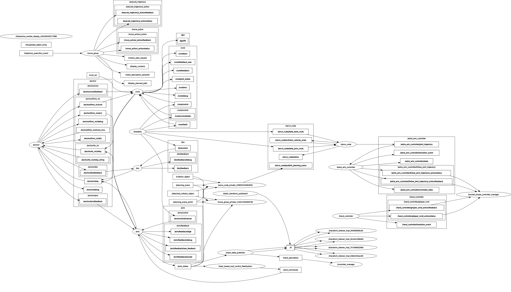

# ASTRA Arm Moveit2 Configuration

[](https://www.gnu.org/licenses/agpl-3.0)

This package contains URDF, configuration, and launch files to support controlling the ASTRA Arm via Moveit2.

## Table of Contents

- [Software Prerequisites](#software-prerequisites)
- [Usage](#usage)
  - [Setup](#setup)
  - [Running](#running)
    - [Switching between sim and real hardware](#switching-between-sim-and-real-hardware)
- [File Structure](#file-structure)
- [Graphs](#graphs)
- [Maintainer(s)](#maintainers)

## Software Prerequisites

You need either [ROS2 Humble](https://docs.ros.org/en/humble/Installation.html) with [rosdep](https://docs.ros.org/en/humble/Tutorials/Intermediate/Rosdep.html#rosdep-installation) or [Nix](https://nixos.org/download/#nix-install-linux) installed. We have not confirmed functionality on Nix or ROS2 Jazzy, so for now I (David) can only offer support with ROS2 Humble on Jammy.

## Usage

### Setup

#### Nix

With Nix, all you have to do is enter the development shell:

```bash
$ cd rover-ros2
$ nix develop
```

#### ROS2 Humble + rosdep

With ROS2 Humble, start by using rosdep to install dependencies:

```bash
  # Setup rosdep (if not already ran):
$ sudo rosdep init
$ rosdep update
  # Install dependencies:
$ cd rover-ros2  # or whatever workspace you are using
$ rosdep install --from-paths src -y --ignore-src
```

Next, build and source the workspace:

```bash
$ colcon build  # recommended flag for developers: --symlink-install
$ source install/setup.bash  # or if you are using zsh: install/setup.zsh
```

### Running

ASTRA's full MoveIt2 stack as it currently stands can be practically invoked standalone; it can either be simulated in Gazebo or used for the physical rover, both in combination with Core's code, with the following commands:

```bash
  # Simulate combined Core + Arm
$ ros2 launch rover_description gazebo.launch.py
  # Run the physical stack for a combined Core + Arm
$ ros2 launch rover_description physical.launch.py
```

`moveit2.launch.py` (move_group + moveit_servo) can still be included on its own for the physical arm; the rover launches supply its `hardware_mode` and combined URDF.

#### Switching between sim and real hardware

The ros2_control backend is selected by the `hardware_mode` xacro/launch argument. The mapping lives in `config/ASTRA_Arm.ros2_control.xacro`:

- `hardware_mode:=gazebo` — `gz_ros2_control/GazeboSimSystem` (only as part of the rover sim).
- `hardware_mode:=physical` — `topic_based_ros2_control/TopicBasedSystem`, interfacing with `anchor` (`/arm/joint_commands` out, `/joint_states` in) to drive the real arm.
- `hardware_mode:=preview` — geometry only, no `<ros2_control>` block (for URDF/RViz preview).

An unrecognized `hardware_mode` fails at xacro expansion rather than silently emitting an invalid controller setup.

## File Structure

 - `config/`
   - **astra_arm_simulated_config.yaml** - Configuration related to moveit_servo (translating Twist/JointJog to JointTrajectory)
   - **ASTRA_Arm.ros2_control.xacro** - ros2_control tags for the arm's urdf
   - **ASTRA_Arm.srdf** - Provides Moveit2 some misc. information about the arm
   - **ASTRA_Arm.urdf.xacro** - Combines the URDF file from `arm_description` and Moveit's xacro files into one xacro file.
   - **initial_positions.yaml** - Startup joint positions, used by `ASTRA_Arm.ros2_control.xacro` as `state_interface` initial values
   - **joint_limits** - Velocity and acceleration limits for each joint, required by Moveit2's motion planner
   - **kinematics.yaml** - Tells Moveit2 what IK solver to use
   - **moveit_controllers** - Tells Moveit2 what controllers are being used
   - **moveit.rviz** - rviz2 config for viewing the move_group state
   - **pilz_cartesian_limits.yaml** - Limits for the motion planner (idfk man :sob:)
   - **ros2_controllers.yaml** - Tells the controller manager how to spawn and configure the required ros2 controllers
 - `launch/`
   - **moveit2.launch.py** - Launches the arm's MoveIt2 core (move_group + moveit_servo); included by the rover Gazebo sim and physical launches
   - **spawn_controllers.launch.py** - Launches all ros2 controllers for Moveit2

## Graphs

> Moveit2 with ros2_joy and real hardware (Anchor and Headless)


## Maintainer(s)

| Name | Email | Discord |
| ---- | ----- | ------- |
| David Sharpe | ds0196@uah.edu | ddavdd |
